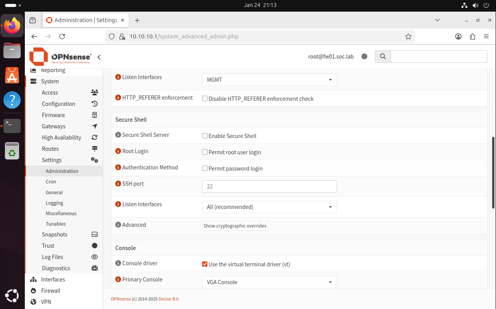
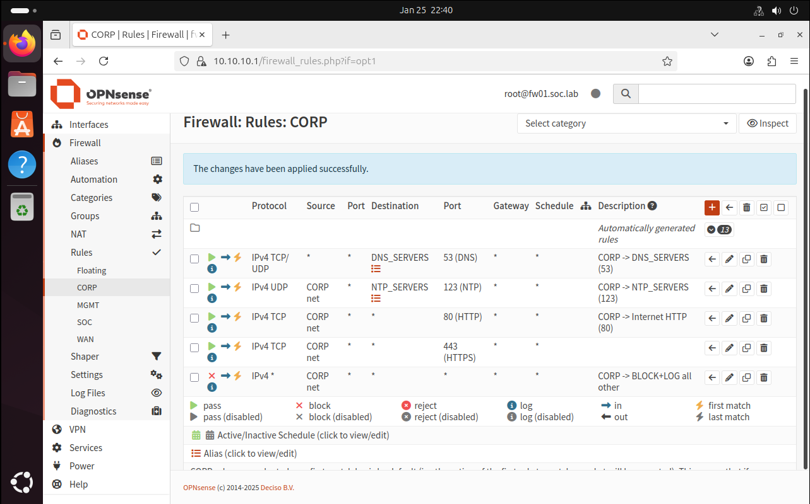
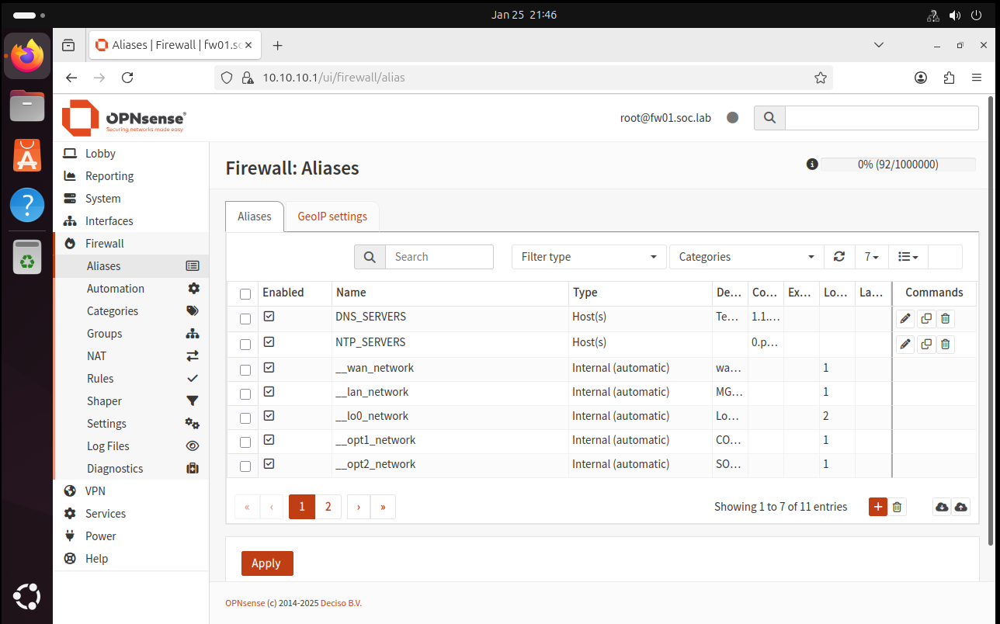

# SOC Corporate Lab — AD + Wazuh SIEM + Incident Response (Portfolio)


This repository documents building a realistic corporate-style security lab from scratch and running SOC workflows on top of it:
- **Active Directory** (Windows Server) + domain-joined endpoints
- centralized logging and detections (**Wazuh SIEM**)
- incident handling: **triage → response → closure** (TP/FP)
- network segmentation + containment (firewall policies)

The goal is a recruiter-friendly portfolio: architecture, configs, detections, runbooks, and incident write-ups with evidence.

---

## Recruiter highlights (what this demonstrates)
- KVM/libvirt networking: NAT + Linux bridges (segmentation)
- OPNsense multi-NIC firewall design + interface mapping
- Least-privilege policy: whitelist + **BLOCK+LOG** egress (with evidence)
- Admin hardening: WebGUI restricted to **MGMT only**
- SOC workflow documentation: **evidence → timeline → decisions → actions → lessons learned**

---

## Evidence (screenshots)
These screenshots are included to prove the lab is actually built and working (not just a write-up).

**Host networking (segmentation via Linux bridges):**  


**FW01 interface/IP plan (multi-NIC mapping):**  


**Hardening (WebGUI listens on MGMT only):**  


**Firewall policy (CORP egress whitelist + BLOCK+LOG):**  


**Logging proof (blocked traffic visible in live view/logs):**  


---

## Build order (MVP)
1) Host setup (KVM/libvirt) + network plan  
2) FW01 (OPNsense): WAN NAT + MGMT/CORP/SOC + baseline rules  
3) DC01: AD DS + DNS + initial OUs/users  
4) Endpoint(s): domain join + Sysmon/agent  
5) SOC01: Wazuh + dashboards + alerts  
6) Run scenarios → write incident reports

---

## MVP scope (status)
- [x] Network plan and addressing (MGMT/CORP/SOC)
- [x] FW01 with deny-by-default egress policy + logging
- [ ] DC01: domain bootstrap + DNS
- [ ] WIN11-CL01: join domain + Sysmon (or equivalent telemetry)
- [ ] SOC01: Wazuh + dashboards + agents
- [ ] Scenarios + write-ups:
  - [ ] 001 Recon / Port scan (detection + containment + TP)
  - [ ] 002 RDP brute force (detection + containment + hardening)

---

## High-level architecture
```text
Internet
  │
  └─ libvirt "default" NAT (WAN, e.g. 192.168.122.0/24)
        │
        ├─ FW01 (OPNsense)
        │    - WAN  (DHCP via libvirt NAT)
        │    - MGMT (10.10.10.0/24)
        │    - CORP (10.20.20.0/24)
        │    - SOC  (10.30.30.0/24)
        │
        ├─ DC01 (Windows Server, AD DS + DNS)        [CORP]
        ├─ WIN11-CL01 (Domain endpoint + telemetry)  [CORP]
        └─ SOC01 (Wazuh SIEM)                        [SOC]
