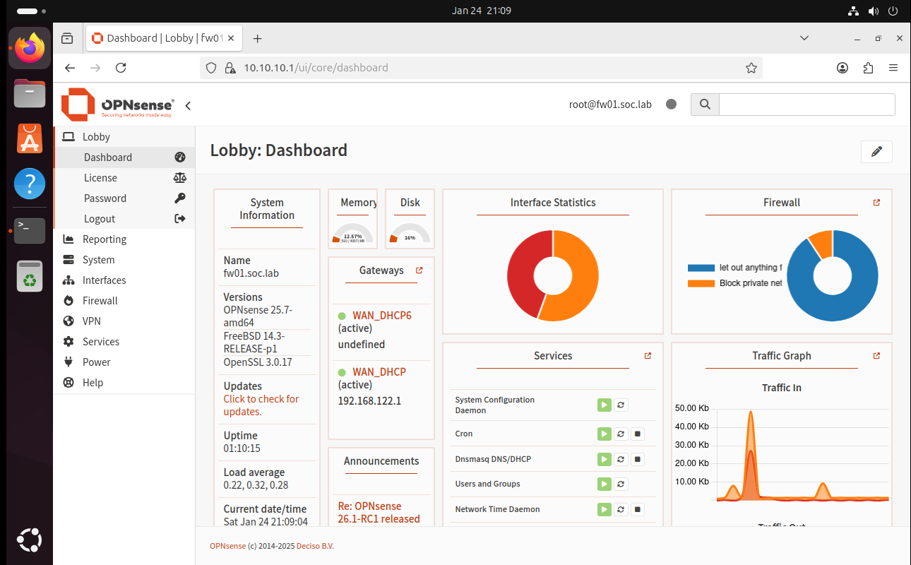
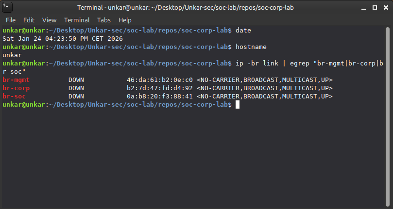
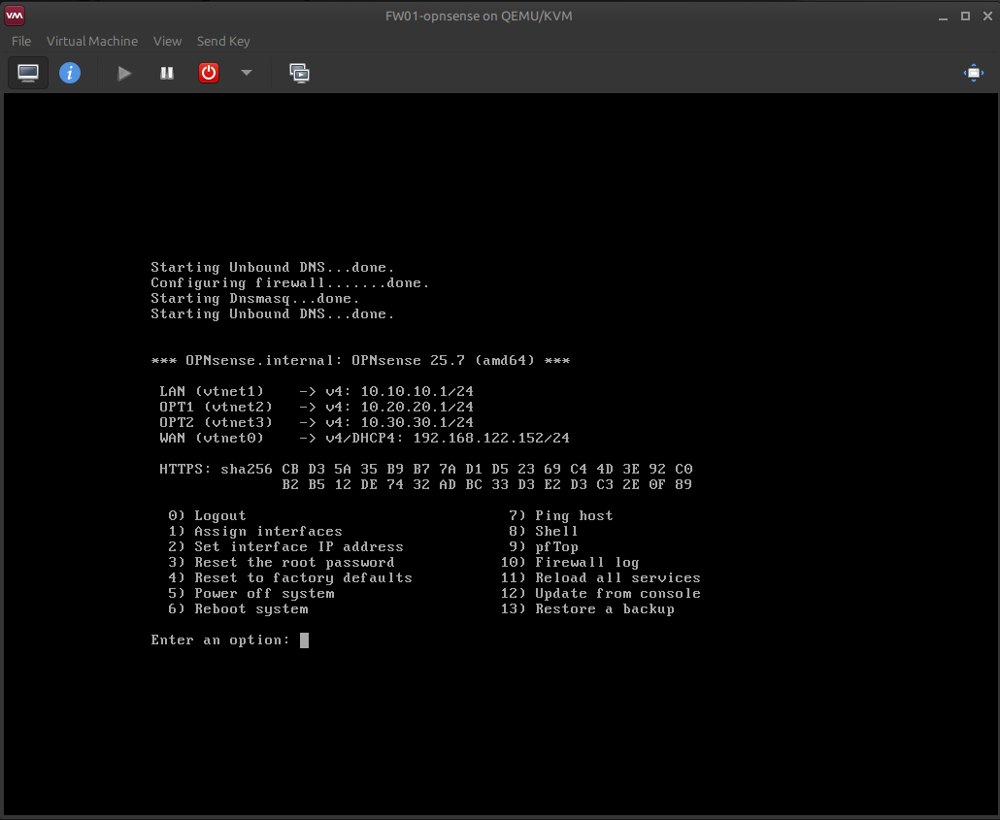
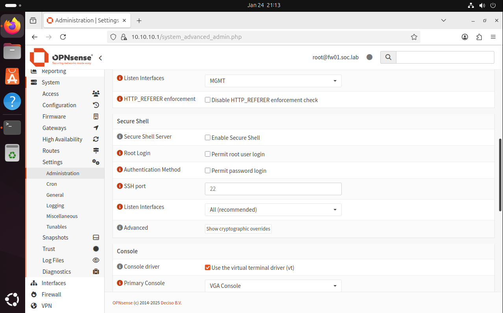
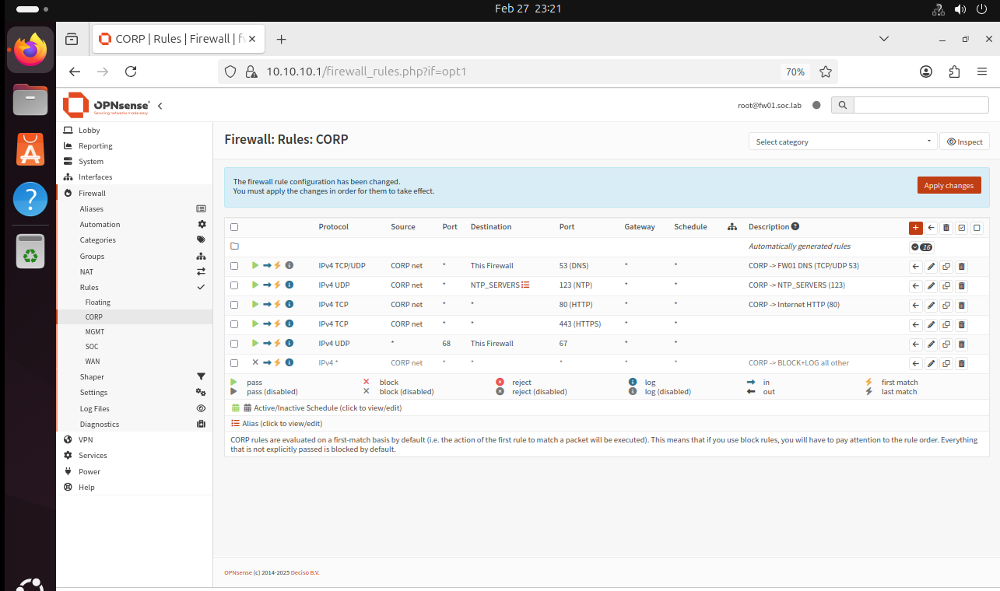
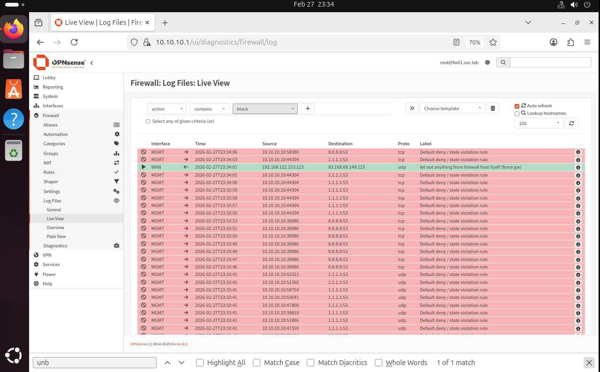
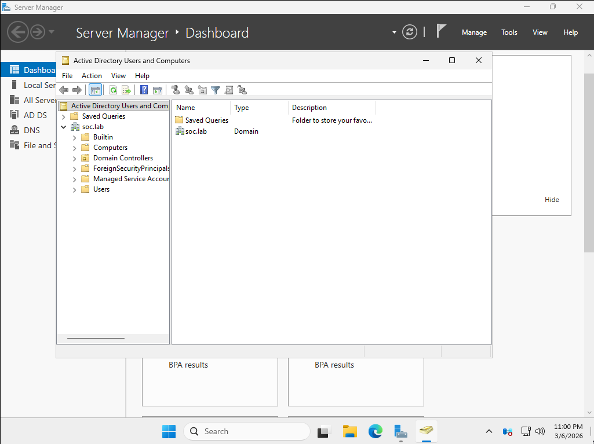
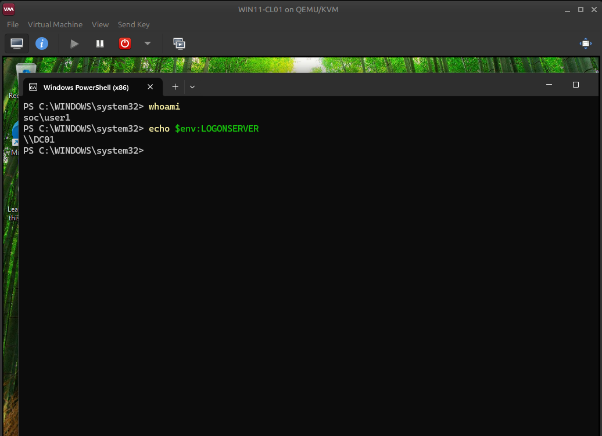

# SOC Corporate Lab — AD + Wazuh SIEM + Incident Response (Portfolio)



This repository documents building a realistic corporate-style security lab from scratch and running SOC workflows on top of it:
- **Active Directory** (Windows Server) + domain-joined endpoints
- centralized logging and detections (**Wazuh SIEM**)
- incident handling: **triage → response → closure** (TP/FP)
- network segmentation + containment (firewall policies)

The goal is a recruiter-friendly portfolio: architecture, configs, detections, runbooks, and incident write-ups with evidence.

---

## Recruiter highlights (what this demonstrates)
- KVM/libvirt networking: NAT + Linux bridges (segmentation)
- OPNsense multi-NIC firewall design + interface mapping
- Least-privilege policy: whitelist + **BLOCK+LOG** egress (with evidence)
- Admin hardening: WebGUI restricted to **MGMT only**
- SOC workflow documentation: **evidence → timeline → decisions → actions → lessons learned**

---

## Latest progress
- DC01 promoted to **`soc.lab`** (AD DS + DNS) with DNS forwarding via FW01 → [docs/ad-setup-dc01.md](docs/ad-setup-dc01.md)
- WIN11-CL01 joined to **`soc.lab`** and validated (`whoami`, `LOGONSERVER`) → [docs/win11-domain-join.md](docs/win11-domain-join.md)

---

## Evidence (screenshots)
These screenshots prove the lab is built and working (not just a write-up).

**Host networking (segmentation via Linux bridges):**  


**FW01 interface/IP plan (multi-NIC mapping):**  


**Hardening (WebGUI listens on MGMT only):**  


**Firewall policy (CORP egress whitelist + BLOCK+LOG):**  


**Logging proof (blocked traffic visible in live view/logs):**  


**Active Directory (domain created):**  


**Endpoint joined to domain (validation):**  


---

## Build order (MVP)
1) Host setup (KVM/libvirt) + network plan  
2) FW01 (OPNsense): WAN NAT + MGMT/CORP/SOC + baseline rules  
3) DC01: AD DS + DNS + initial OUs/users  
4) Endpoint(s): domain join + baseline validation  
5) SOC01: Wazuh + dashboards + agents  
6) Run scenarios → write incident reports

---

## MVP scope (status)
- [x] Network plan and addressing (MGMT/CORP/SOC)
- [x] FW01 with deny-by-default egress policy + logging
- [x] DC01: domain bootstrap + DNS (`soc.lab`)
- [x] WIN11-CL01: join domain + baseline validation
- [ ] SOC01: Wazuh + dashboards + agents
- [ ] Scenarios + write-ups:
  - [ ] 001 Recon / Port scan (detection + containment + TP)
  - [ ] 002 RDP brute force (detection + containment + hardening)

---

## Documentation (start here)
**Core docs:**
- `docs/network-plan.md`
- `docs/architecture.md`
- `docs/threat-model.md`

### Networking & Firewall (FW01)
- [Host networking (KVM/libvirt)](docs/host-networking-kvm.md)
- [FW01 OPNsense setup](docs/fw01-opnsense-setup.md)
- [FW01 firewall policy (MGMT/CORP/SOC)](docs/fw01-firewall-policy.md)

### Active Directory (DC01)
- [DC01 AD/DNS setup (soc.lab)](docs/ad-setup-dc01.md)

### Endpoints
- [WIN11-CL01 domain join (soc.lab)](docs/win11-domain-join.md)


## Lab safety model
All testing is done in an isolated lab environment:
- Segmented networks: **MGMT / CORP / SOC** (+ optional MAL later).
- Policy: **only the firewall (FW01) has controlled WAN access**; other VMs do not directly touch the home network.
- No host↔guest convenience channels for risky VMs: shared folders / clipboard / drag&drop = **OFF** (enable temporarily only when needed).
- Use disposable VMs: snapshot → test → revert.
- Focus on **TTP simulations and safe test scenarios** (no destructive payloads).

---

## Verification (quick checks)
- From **MGMT workstation**: access OPNsense WebGUI via `https://<FW01_MGMT_IP>` (MGMT-only)
- From **CORP**: DNS/NTP/HTTP(S) allowed; Live View shows **BLOCK+LOG** hits
- On **DC01**: `nslookup example.com` works (external resolution via forwarder)
- On **WIN11-CL01**: `whoami` shows `soc\user1` and `LOGONSERVER` points to `\\DC01`

---

## License
MIT License — see `LICENSE`.


## High-level architecture
```text
Internet
  │
  └─ libvirt "default" NAT (WAN, e.g. 192.168.122.0/24)
        │
        ├─ FW01 (OPNsense)
        │    - WAN  (DHCP via libvirt NAT)
        │    - MGMT (10.10.10.0/24)
        │    - CORP (10.20.20.0/24)
        │    - SOC  (10.30.30.0/24)
        │
        ├─ DC01 (Windows Server, AD DS + DNS)        [CORP]
        ├─ WIN11-CL01 (Domain endpoint + telemetry)  [CORP]
        └─ SOC01 (Wazuh SIEM)                        [SOC]
