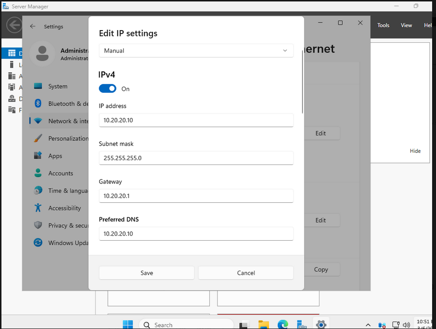
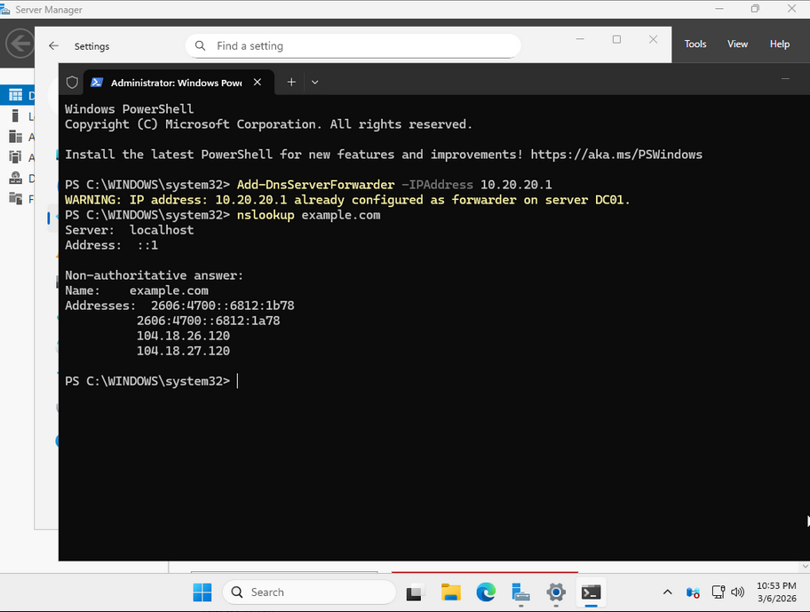

# DC01 (Active Directory + DNS)

## Milestone: Domain created (soc.lab)
- DC01 has a static IP in CORP (`10.20.20.10/24`) with gateway `10.20.20.1` (FW01).
- DNS is set to self (`10.20.20.10`).
- DNS forwarder points to FW01 (`10.20.20.1`).
- External resolution works (`nslookup example.com`).

