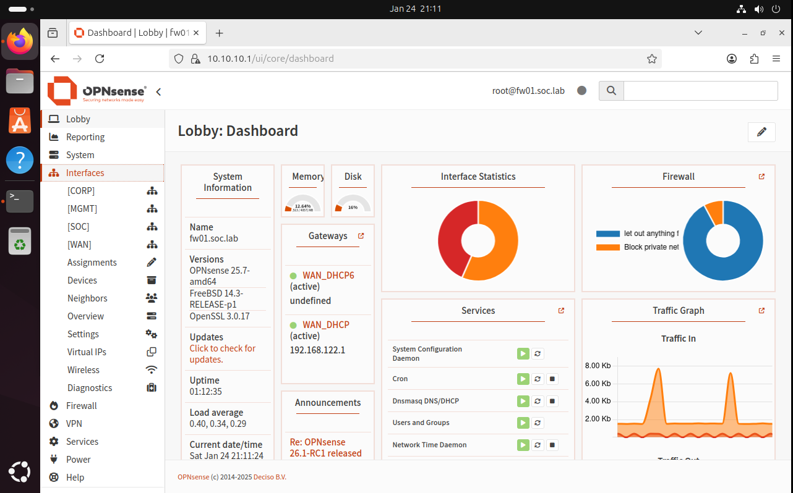
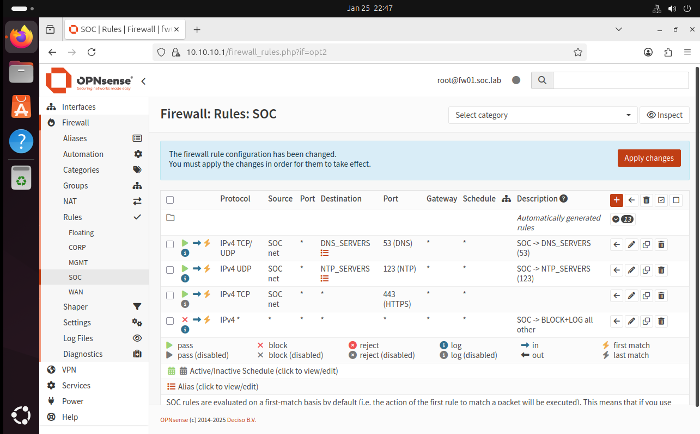

# FW01 — Firewall Policy (MGMT / CORP / SOC)

## Goal
Demonstrate basic segmentation and **least privilege**:
- **MGMT**: administrative access (WebGUI) only from MGMT workstation
- **CORP/SOC**: allow only essential outbound services; everything else **BLOCK+LOG**

---

## Interface Naming (Clarity)
Interfaces are labeled with friendly names for readability and long-term maintenance.

---

## Hardening: WebGUI Listens on MGMT Only
The WebGUI is restricted to the MGMT interface to reduce the exposed management surface.

---

## MGMT Rules
Example of tightening defaults and allowing only the required admin traffic (e.g., MGMT-WS → FW01 WebGUI/443).

---

## CORP Rules — Whitelist + BLOCK+LOG
Typical minimal outbound policy for CORP:
- DNS (to defined DNS servers)
- NTP (to defined NTP servers)
- HTTP/HTTPS outbound as required
- Everything else: **BLOCK+LOG**

Evidence of blocks in live view/logs:

---

## SOC Rules — Whitelist + BLOCK+LOG
SOC zone follows the same principle (tight egress + logging). Example policy is shown below.

