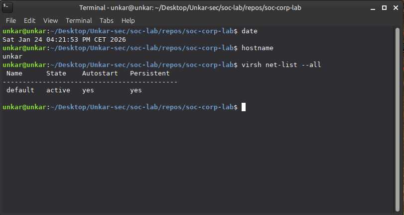
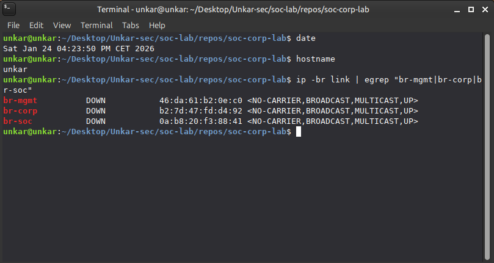

# Host Networking (KVM/libvirt)

## WAN: libvirt NAT (`default`)
FW01 WAN uses libvirt’s built-in NAT network (`default`). This typically provides DHCP in the `192.168.122.0/24` range.

## L2 Bridges on the Host (Lab Zones)
The host provides separate Linux bridges for each lab zone:
- `br-mgmt`
- `br-corp`
- `br-soc`

> Note: A bridge can show `DOWN/NO-CARRIER` until an active VM vNIC is attached. That is expected.

