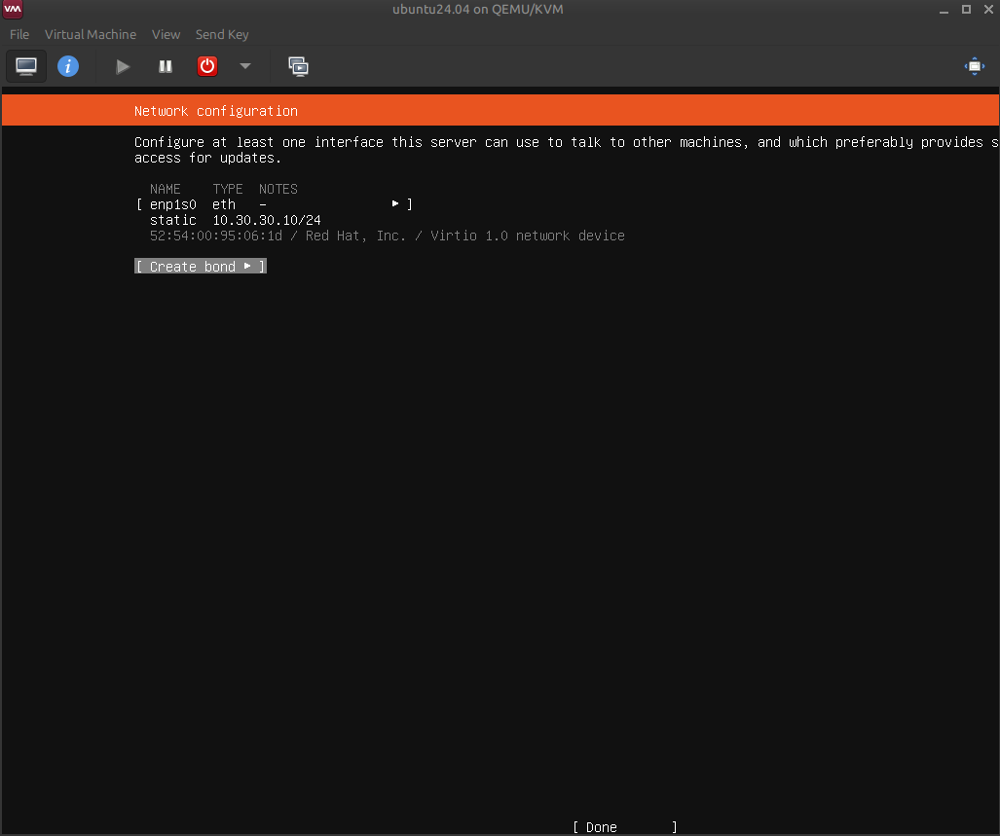
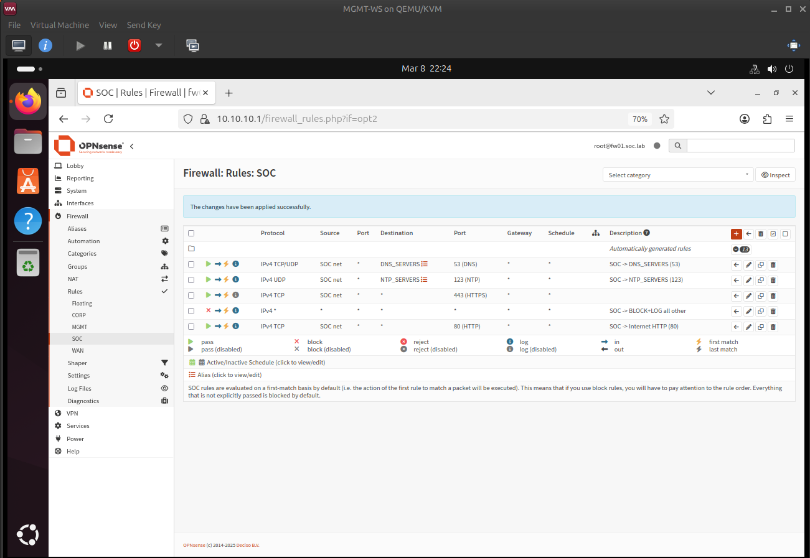

# SOC01 — Build started (Ubuntu Server)

## Status
SOC01 is being provisioned in the SOC network and prepared for Wazuh deployment.

## Milestone (in progress)
- SOC01 static IP: `10.30.30.10/24`
- Gateway: `10.30.30.1` (FW01)
- FW01 SOC egress updated to allow HTTP (80) for Ubuntu mirror access

## Evidence

