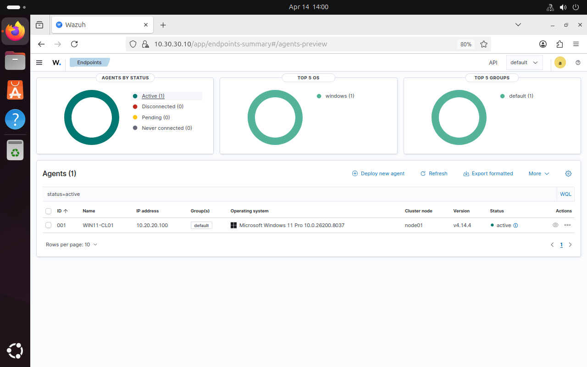

# Wazuh — WIN11-CL01 agent enrollment (evidence)

**Goal:** Connect the first Windows endpoint to Wazuh and verify it reports as **Active**.

**Result:** Agent `WIN11-CL01` enrolled successfully and appears as **Active** in the Wazuh dashboard.

