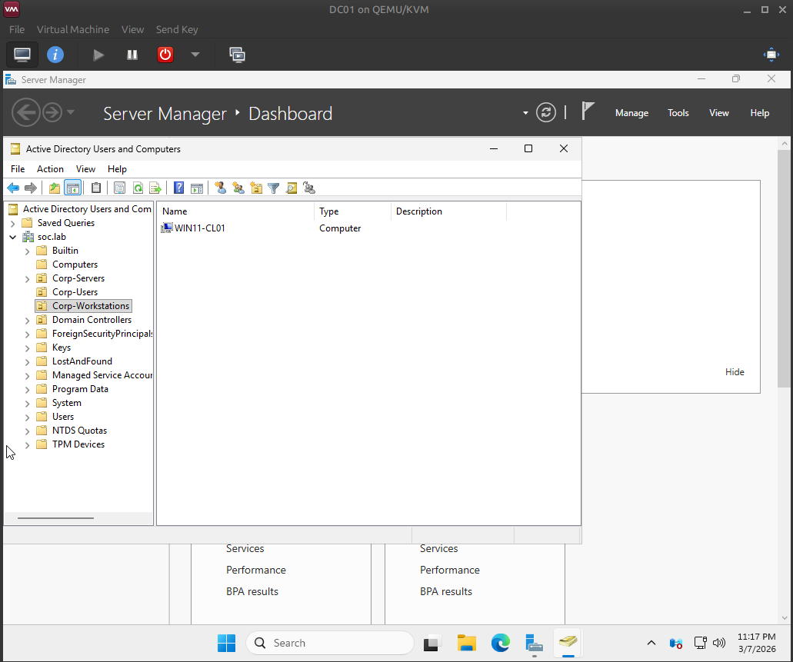

# WIN11-CL01 — Domain Join (soc.lab)

## Milestone
WIN11-CL01 was joined to the `soc.lab` domain and validated as a domain user session.

## Pre-checks
- Endpoint DNS points to DC01 (`10.20.20.10`)
- DC01 provides external resolution via DNS forwarder to FW01 (`10.20.20.1`)

## Validation
- `whoami` shows a domain identity (`soc\user1`)
- `LOGONSERVER` points to `\\DC01`
- Computer account is placed in `Corp-Workstations` OU

## Evidence

